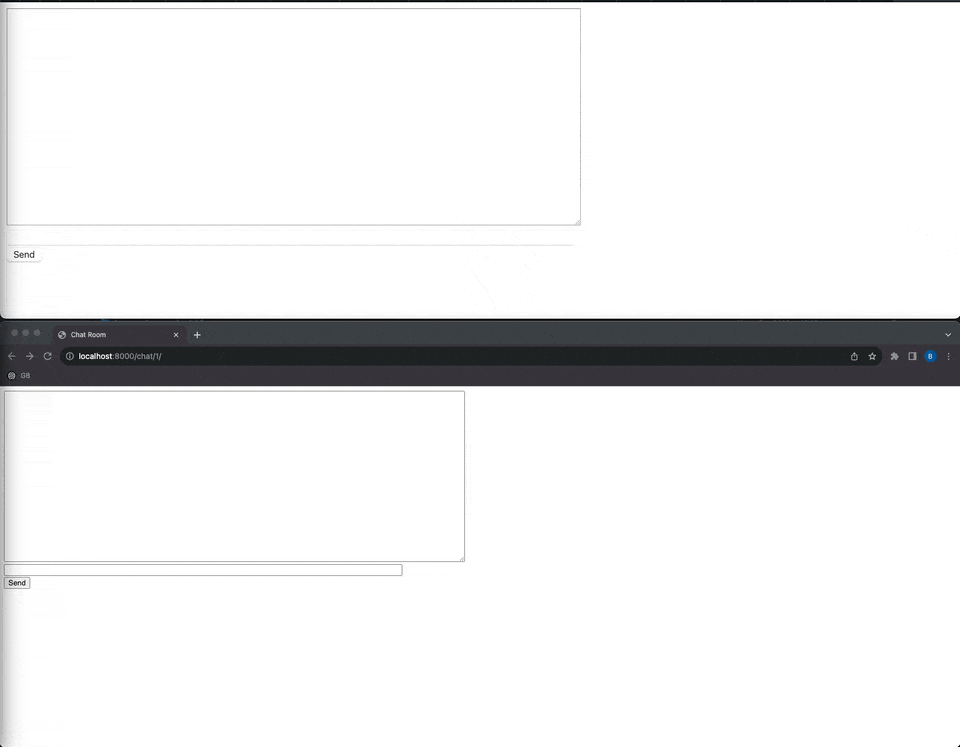

# Tutorials by Django-Channels

This is the execution of the [tutorial](https://channels.readthedocs.io/en/latest/tutorial/index.html) that is provided by the django-channels documentation. Provides a basic introduction to working with channels. This mini-project implements a simple chat room.



## Quick start

Clone project and after this use next command

```bash
docker-compose up
```

## Additional sources

- [Channels latest](https://channels.readthedocs.io/en/latest)
- [Introduction to Django Channels](https://testdriven.io/blog/django-channels/)
- [Channels 3.0.3](https://django.fun/ru/docs/channels/3/)
- [Daphne](https://github.com/django/daphne/), сервер HTTP и Websocket
- [asgiref](https://github.com/django/asgiref/), базовая библиотека ASGI
- [channel_redis](https://github.com/django/channels_redis/), серверная часть для работы Channels с Redis (необязательно)
- [Django Channels – ответ современному вебу](https://habr.com/ru/companies/oleg-bunin/articles/418445/) (habr)
- [Django Channels: работа с WebSocket и не только](https://khashtamov.com/ru/django-channels-websocket/)
